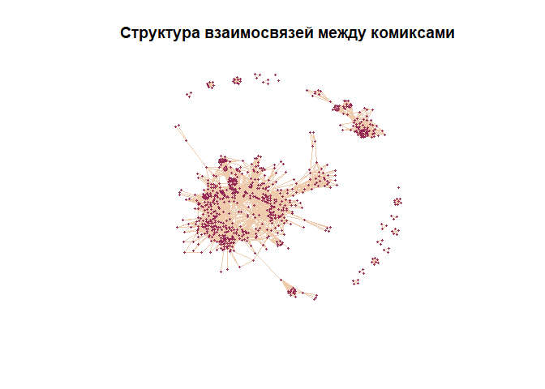
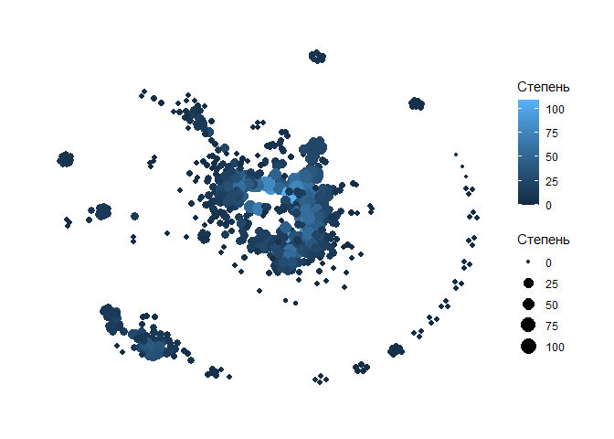
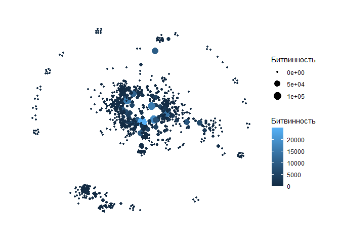
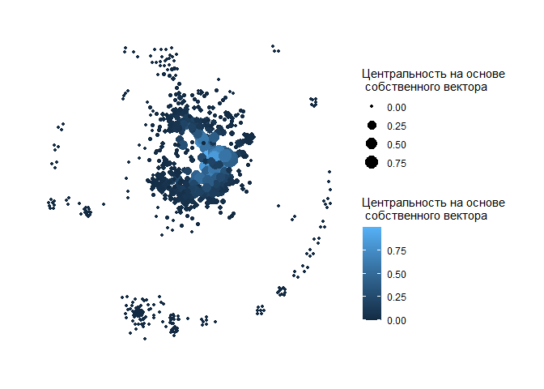
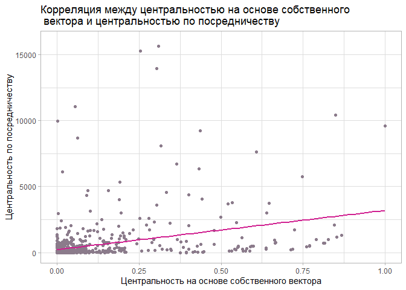
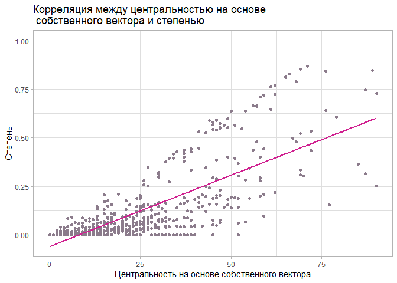
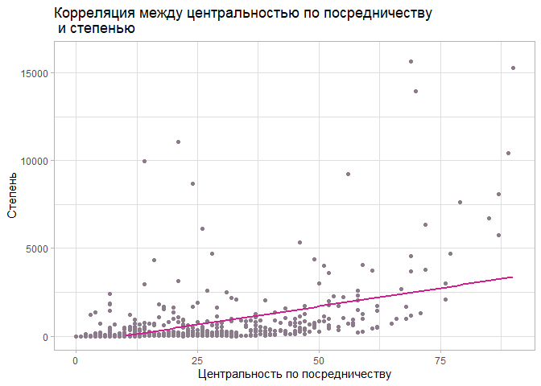
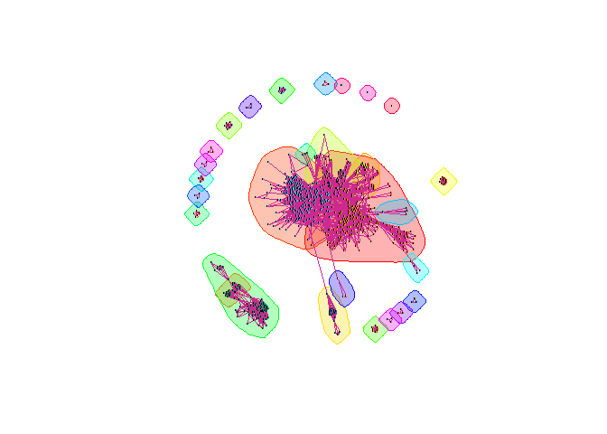
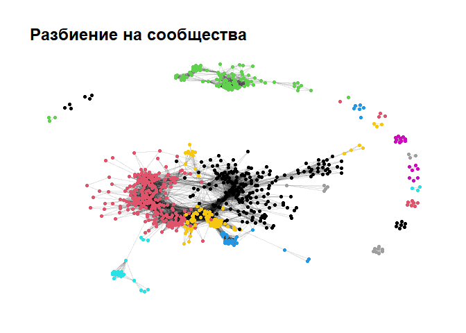
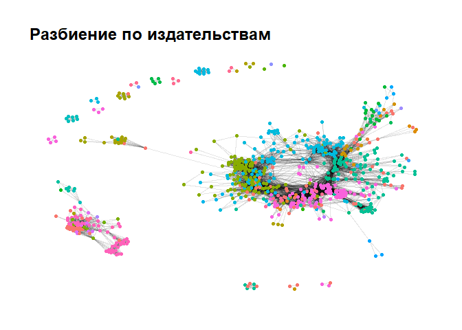

Анализ сетей книг
================

Задача: исследовать структуру взаимосвязей между комиксами. Для этого
дана сеть из 777 популярных комиксов, где связь между книгами – это
похожесть по оценкам пользователей (если книги похожи по
пользовательским оценкам, то между ними в графе есть связь).

``` r
library(igraph)
library(dplyr)
library(ggraph)   
library(ggplot2)
library(tidyverse)
library(tibble)
library(knitr)
library(ggthemes)
comics_net = read_graph(file="C:/data_science/hw_nets/book_net.hml", format = "graphml")
load("C:/data_science/hw_nets/books_net_info.RData")
```

Построим граф, чтобы визуально оценить данные.

``` r
# как выглядит граф?
plot(comics_net,
     vertex.label = NA,
     vertex.size =2,
     vertex.frame.color = "violetred4",
     vertex.color = "maroon",
     edge.color="peachpuff2",
     vertex.shape   = "circle",
     main="Структура взаимосвязей между комиксами")  
```

<!-- -->

## Исследовательские вопросы

1)Коррелируют ли меры центральности вершин?

Иными словами: Будет ли одинаково важен конкретный комикс (в системе
похожести комиксов), если применять разные меры центральности?

2)Влияет ли издатель комикса на разбиение вершин по сообществам?

Если есть группа комиксов, которые, по оценкам пользователей, больше
похоже друг с другом, чем со всеми остальными комиксами, то важен ли
издатель при образовании такой группы?

## Выявление значимых вершин

Измеряем центральность. Посмотрим, какие вершины самые важные по
степени, собственному вектору, битвинности.

``` r
# вычислим меры центральности и запишем их в датасет
degrees = data.frame(degree(comics_net)) %>% rownames_to_column()
eigenv = data.frame(eigen_centrality(comics_net)) %>% select(vector) %>% rownames_to_column()
between = data.frame(betweenness(comics_net)) %>% rownames_to_column()
centrality_measures = right_join(degrees,eigenv)
centrality_measures = right_join(centrality_measures, between)
colnames(centrality_measures)=c("book_id","degree","eigen_centrality","betweenness")
centrality_measures$book_id=as.numeric(centrality_measures$book_id)
books_net_info=left_join(books_net_info,centrality_measures)
centrality_measures$book_id=as.numeric(centrality_measures$book_id)
books_net_info=left_join(books_net_info,centrality_measures)
```

**Степень:**

``` r
comics_net %>%
  ggraph(layout = "nicely") +
  geom_edge_link(alpha = 0.1, color=NA) +
  geom_node_point(aes(color = degree(comics_net), size=degree(comics_net)))+
  scale_size_continuous(name="Степень") +
  scale_color_continuous(name="Степень") +
  theme_graph()
```

<!-- -->

**Центральность по посредничеству:**

``` r
comics_net %>%
  ggraph(layout = "nicely") +
  geom_edge_link(alpha = 0.1, color=NA) +
  geom_node_point(aes(color = betweenness(comics_net),size=6*betweenness(comics_net)))+
  scale_size_continuous(name="Битвинность") +
  scale_color_continuous(name="Битвинность") +
  theme_graph()
```

<!-- -->

**Мера центральности на основе собственного вектора:**

``` r
comics_net %>%
  ggraph(layout = "nicely") +
  geom_edge_link(alpha = 0.1, color=NA) +
  geom_node_point(aes(color = eigen_centrality(comics_net)$vector, size=eigen_centrality(comics_net)$vector))+
  scale_size_continuous(name="Центральность на основе\n собственного вектора") +
  scale_color_continuous(name="Центральность на основе\n собственного вектора") +
  theme_graph()
```

<!-- -->

Посмотрим на топ-3 самых важных вершин по каждой мере центральности.

``` r
# 3 вершины с наибольшей степенью
deg3=books_net_info %>% select("book_id","title", "degree") %>%  arrange(-degree) %>%  head(3)
# 3 вершины с наибольшей мерой центральности на основе собственного вектора
eig3=books_net_info %>% select("book_id","title", "eigen_centrality") %>%  arrange(-eigen_centrality) %>%  head(3)
# 3 вершины с наибольшей центральностью по посредничеству
bet3=books_net_info %>% select("book_id","title", "betweenness") %>%  arrange(-betweenness) %>%  head(3)
# Посмотрим на самые важные вершины по каждому показателю
kable(deg3, col.names=c("ID","Название комикса", "Центральность по степени"))
```

|       ID | Название комикса                  | Центральность по степени |
|---------:|:----------------------------------|-------------------------:|
|   156534 | Y: The Last Man, Vol. 1: Unmanned |                      109 |
|    21326 | Fables, Vol. 1: Legends in Exile  |                       92 |
| 15704307 | Saga, Vol. 1 (Saga, \#1)          |                       90 |

``` r
kable(eig3, col.names=c("ID","Название комикса", "Центральность на основе собственного вектора"))
```

|     ID | Название комикса                            | Центральность на основе собственного вектора |
|-------:|:--------------------------------------------|---------------------------------------------:|
|  21326 | Fables, Vol. 1: Legends in Exile            |                                    1.0000000 |
| 156534 | Y: The Last Man, Vol. 1: Unmanned           |                                    0.9857596 |
| 167010 | Fables, Volume 2: Animal Farm (Fables, \#2) |                                    0.8679618 |

``` r
kable(bet3, col.names=c("ID","Название комикса", "Центральность по посредничеству"))
```

|       ID | Название комикса                       | Центральность по посредничеству |
|---------:|:---------------------------------------|--------------------------------:|
|   156534 | Y: The Last Man, Vol. 1: Unmanned      |                        24992.55 |
| 15704307 | Saga, Vol. 1 (Saga, \#1)               |                        18306.75 |
| 16002136 | Hawkeye, Volume 1: My Life as a Weapon |                        15667.47 |

Объединим три этих таблицы, чтобы визуально быстрее проверить, не входит
ли один и тот же комикс сразу в несколько топ-3.

``` r
# объединим, чтобы посмотреть, совпадает ли важность у топа вершин
kable(full_join(deg3,eig3) %>%  full_join(bet3), col.names = c("ID","Название комикса", "Степень", "По собств. вектору", "По посредничеству"))
```

|       ID | Название комикса                            | Степень | По собств. вектору | По посредничеству |
|---------:|:--------------------------------------------|--------:|-------------------:|------------------:|
|   156534 | Y: The Last Man, Vol. 1: Unmanned           |     109 |          0.9857596 |          24992.55 |
|    21326 | Fables, Vol. 1: Legends in Exile            |      92 |          1.0000000 |                NA |
| 15704307 | Saga, Vol. 1 (Saga, \#1)                    |      90 |                 NA |          18306.75 |
|   167010 | Fables, Volume 2: Animal Farm (Fables, \#2) |      NA |          0.8679618 |                NA |
| 16002136 | Hawkeye, Volume 1: My Life as a Weapon      |      NA |                 NA |          15667.47 |

Можно заметить, что одни и те же вершины оказываются важнейшими
одновременно по некоторым показателям. В таблице представлены самые три
самые важные вершины по каждой мере центральности. Можно заметить, что
вершина “Y: The Last Man, Vol. 1: Unmanned” (ID 156534) входит в топ-3
самых значимых по всем трем показателям. “Fables, Vol. 1: Legends in
Exile” (ID 21326) и “Saga, Vol. 1 (Saga, \#1)” (ID 15704307) входят в
топ-3 по двум показателям. Таким образом, можно заметить, что вершины
имеют свойство быть важными сразу по нескольким мерам центральности.
Возникает вопрос:

#### 1) Коррелируют ли меры центральности вершин?

``` r
# есть ли зависимость между значениями мер центральности?
kable(cor(books_net_info$eigen_centrality, books_net_info$betweenness), col.names="Корреляция между центральностью на основе собственного вектора и центральностью по посредничеству") #Слабая корреляция
```

| Корреляция между центральностью на основе собственного вектора и центральностью по посредничеству |
|--------------------------------------------------------------------------------------------------:|
|                                                                                         0.3969773 |

``` r
kable(cor(books_net_info$eigen_centrality, books_net_info$degree), col.names="Корреляция между центральностью на основе собственного вектора и степенью") #Сильная корреляция
```

| Корреляция между центральностью на основе собственного вектора и степенью |
|--------------------------------------------------------------------------:|
|                                                                 0.7696325 |

``` r
kable(cor(books_net_info$betweenness, books_net_info$degree), col.names="Корреляция между центральностью по посредничеству и степенью") #Средняя корреляция
```

| Корреляция между центральностью по посредничеству и степенью |
|-------------------------------------------------------------:|
|                                                    0.5305999 |

``` r
ggplot(books_net_info, mapping = aes(x=eigen_centrality, y=betweenness))+
  geom_point(color="thistle4")+
  geom_smooth(method="lm", se = FALSE, color="violetred")+
  ggtitle("Корреляция между центральностью на основе собственного\n вектора и центральностью по посредничеству")+
  theme_light()+
  xlab("Центральность на основе собственного вектора")+
  ylab("Центральность по посредничеству")+
  ylim(0,16000)
```

<!-- -->

``` r
ggplot(books_net_info, mapping = aes(y=eigen_centrality, x=degree))+
  geom_point(color="thistle4")+
  geom_smooth(method="lm", se = FALSE, color="violetred")+
  ggtitle("Корреляция между центральностью на основе\n собственного вектора и степенью")+
  theme_light()+
  xlab("Центральность на основе собственного вектора")+
  ylab("Степень")+
  xlim(0,90)
```

<!-- -->

``` r
ggplot(books_net_info, mapping = aes(y=betweenness, x=degree))+
  geom_point(color="thistle4")+
  geom_smooth(method="lm", se = FALSE, color="violetred")+
  ggtitle("Корреляция между центральностью по посредничеству\n и степенью")+
  theme_light()+
  xlab("Центральность по посредничеству")+
  ylab("Степень")+
  ylim(0,16000)+
  xlim(0,90)
```

<!-- -->

Изучены взаимосвязи между тремя мерами центральности. Выявлена сильная
корреляция между центральностью на основе собственного вектора и
степенью, средняя корреляция - между центральностью по посредничеству и
степенью, слабая - между центральностью на основе собственного вектора и
центральностью по посредничеству.

Таким образом, можно сделать интересное заключение: чем больше связей
похожести у некоторого комикса, тем с более высокой вероятностью эти
комиксы вокруг будут важными, и наоборот.

## Выявление групп книг

#### 2) Влияет ли издатель комикса на разбиение вершин по сообществам?

Осуществим разбиение по сообществам. Обозначим их на рисунке:

``` r
# разделяю на сообщества
comics_net_com<- fastgreedy.community(comics_net)
member = membership(comics_net_com)

# рисую разбиение
plot(comics_net_com, comics_net,
     vertex.label = NA,
     vertex.size =1,
     vertex.color ="midnightblue",
     edge.color = "maroon3",
     edge.width=0.01)
```

<!-- -->

Получили 28 сообществ. Внутри каждого из них комиксы обладают более
сильной схожестью друг с другом, нежели с комиксами извне.  
Проверим, насколько неслучайно алгоритм разбил наш граф на такие группы,
для этого вычислим модулярность:

``` r
# проверяю модулярнсть
kable(modularity(comics_net_com), col.names="Модулярность")
```

| Модулярность |
|-------------:|
|    0.6571612 |

``` r
# записываю принадлежность сообществу в датасет
memb = tibble::enframe(membership(comics_net_com))
memb$name=as.numeric(memb$name)
colnames(memb)=c('name','membership')
books_net_info=left_join(books_net_info,memb, by=c('book_id'='name'))
```

Модулярность - то есть неслучайность такого разбиения - достаточно
высока, чтобы утверждать, что разбиение справедливое и ему можно
доверять.

``` r
# сейчас будем навешивать графу характеристики из датафрейма
comics_net_graph = igraph::as_data_frame(comics_net, 'both')
books_net_info$book_id=as.character(books_net_info$book_id)

comics_net_graph$vertices <- comics_net_graph$vertices %>% 
  left_join(books_net_info, c('name'='book_id'))

comics_net <- graph_from_data_frame(comics_net_graph$edges,
                                   directed = F,
                                   vertices = comics_net_graph$vertices)
```

Интересно, зависит ли принадлежность к сообществу от издателя? Визуально
сравним:

``` r
# раскрашиваем вершины по членству
comics_net %>% 
  ggraph(layout = "nicely")+
  ggtitle("Разбиение на сообщества")+
  geom_edge_link(alpha = 0.1) +
  geom_node_point(color = membership(comics_net_com))+
  theme_graph()
```

<!-- -->

``` r
# раскрашиваем вершины по издателям
comics_net %>%
  ggraph(layout = "nicely") +
  ggtitle("Разбиение по издательствам")+
  geom_edge_link(alpha = 0.1) +
  geom_node_point(aes(color = V(comics_net)$publisher))+
  theme_graph()+
  theme(legend.position = 'none')
```

<!-- -->

Действительно, прослеживается некоторая закономерность: на обоих
рисунках вершины группируются. Проверим при помощи Критерия хи-квадрат
Пирсона, как связаны две дискретные переменные, отвечающие за издателя и
за сообщество.  
Гипотеза: издатель комиксов важен при формировании групп похожих, по
оценкам пользователей, комиксов.

``` r
# зависит ли сообщество вершины от издателя?
books_net_info$publisher =as.factor(books_net_info$publisher)
books_net_info$membership =as.factor(books_net_info$membership)

ch <- chisq.test(books_net_info$publisher, books_net_info$membership)
ch
```


        Pearson's Chi-squared test

    data:  books_net_info$publisher and books_net_info$membership
    X-squared = 9480.1, df = 1917, p-value < 2.2e-16

Значение p-value получилось чрезвычайно низким. Таким образом,
распределение представляется далеко не случайным и гипотеза о том, что
издатель важен для образования комьюнити похожих комиксов, принимается с
вероятностью 0.99.

## Общие выводы

В ходе исследования комиксов, объединенных связями сходства, было
установлено, что наиболее важные по степени в этой сети комиксы имеют
тенденцию быть важнее и по мере центральности на основе собственного
вектора. Количество похожих комиксов связано с важностью соседних по
связям комиксов. То есть комиксы, которые часто обсуждаются
пользователями, обладающие некой универсальностью в сравнении, окружены
связями с такими же довольно важными комиксами.

Издательства оказывают сильное влияние на разбиение комиксов по
сообществам. Комиксы объединяются в некоторые группы, где бывают чаще
похожи друг на друга, нежели чем на комиксы других издательств.
